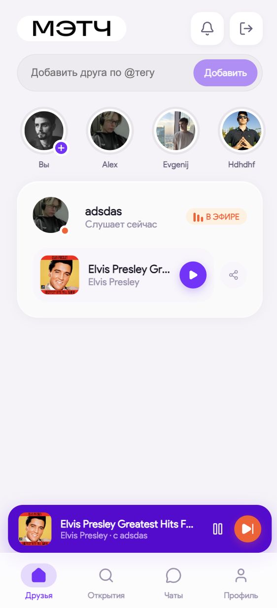
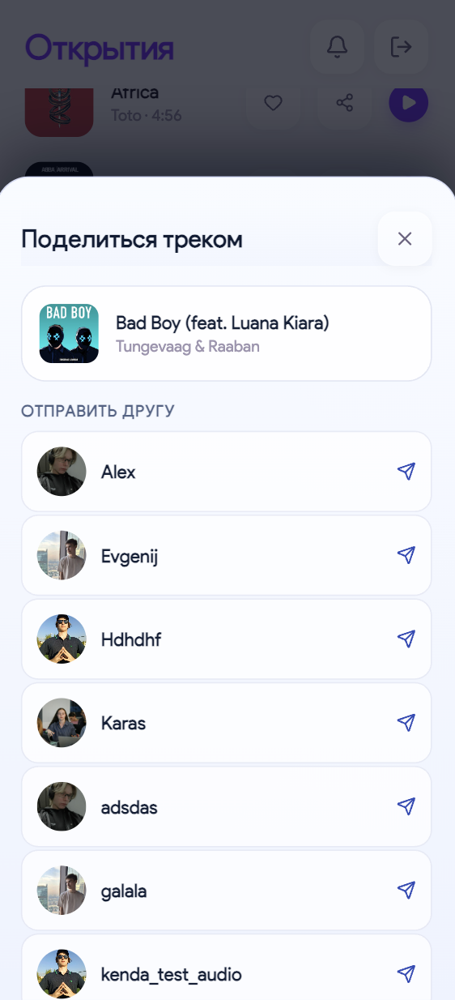
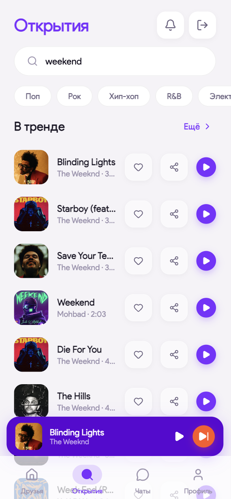
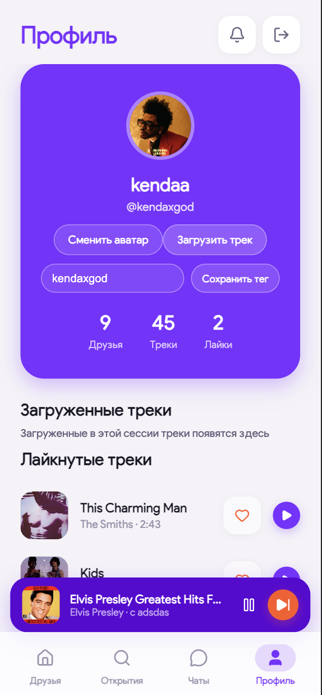

# bootcamp-match

<p align="center">
  
</p>

<p align="center">
  Социальный музыкальный MVP: друзья, совместное прослушивание, чат и realtime-статус треков.
</p>

<p align="center">
  <a href="https://matchapp.site">🌐 Production</a>
</p>

---

## О проекте

`bootcamp-match` — монорепозиторий с веб-клиентом и API-сервером.

- Фронтенд: `Vite + React + TypeScript`
- Бэкенд: `FastAPI + PostgreSQL + Alembic`
- Инфра: `Nginx + systemd`

## Структура

```text
.
├── web-app/               # React-приложение
├── CU-weekend-2026/       # FastAPI + миграции + модели
├── photos/                # локальные ассеты (не для git)
└── README.md
```

Ключевые файлы:

- `web-app/src/App.tsx` — главный UI/плеер/сессии/чаты
- `web-app/src/index.css` — стили интерфейса
- `web-app/src/data/mockData.ts` — демо-структуры и fallback-данные
- `CU-weekend-2026/app/main.py` — REST API
- `CU-weekend-2026/app/models.py` — SQLAlchemy модели
- `CU-weekend-2026/app/schemas.py` — Pydantic схемы
- `CU-weekend-2026/alembic/versions/` — миграции БД

## Возможности

- Регистрация/вход по email и паролю
- Друзья и поиск пользователей
- Лайки, профиль, смена аватара, редактирование `@tag`
- Поиск треков и стриминг через backend
- Совместное прослушивание:
  - приглашение/принятие
  - синхронизация позиции
  - чат внутри сессии

## Скриншоты

<p align="center">
  
  
  
  
</p>

## Быстрый старт

### 1) Фронтенд

```bash
cd web-app
npm install
npm run dev
```

Сборка:

```bash
npm run build
```

### 2) Бэкенд (Docker)

```bash
cd CU-weekend-2026
docker compose up --build
```

### 3) Бэкенд (venv)

```bash
cd CU-weekend-2026
python3 -m venv .venv
source .venv/bin/activate
pip install -r requirements.txt
alembic upgrade head
uvicorn app.main:app --host 127.0.0.1 --port 8000
```

## API (основное)

- Auth: `/api/auth/register`, `/api/auth/login`
- Профиль: `/api/me`, `/api/me/tag`, `/api/me/avatar/upload`
- Музыка: `/api/music/search`, `/api/music/stream/{video_id}`
- Друзья: `/api/friends`, `/api/users/search`
- Совместное прослушивание:
  - `/api/listen/invite`
  - `/api/listen/incoming`
  - `/api/listen/active`
  - `/api/listen/{session_id}/accept`
  - `/api/listen/{session_id}/state`
  - `/api/listen/{session_id}/messages`
  - `/api/listen/{session_id}/end`

## Production

- Домен: `https://matchapp.site`
- Фронтенд (Nginx root): `/var/www/matchapp`
- API (local upstream): `127.0.0.1:8000`
- systemd сервис: `matchapp-api.service`
- Серверный код API: `/opt/cu-backend`

## Важно

- Секреты и локальные окружения в репозиторий не коммитятся (`.env`, `.venv`, `node_modules`, `dist`, uploads и т.д.)
- Для фронтенда используется `VITE_API_BASE_URL` (по умолчанию: `https://matchapp.site/api`)

---

Если нужен отдельный README для мобильной части (`Capacitor Android/iOS`), его можно вынести в `web-app/MOBILE.md` с инструкцией сборки apk/ipa.
